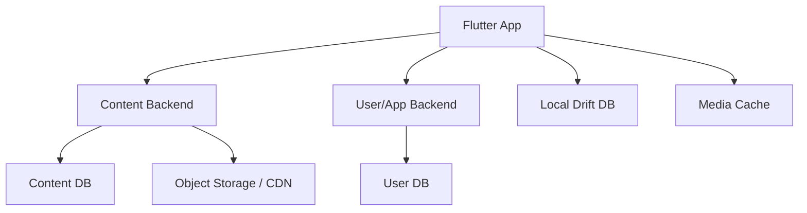

# Backend Architecture Plan

This document defines the planned backend split for Wudase. The Flutter app remains the user-facing client, while deployable backend services handle content delivery, user sync, reports, and future admin workflows.

## Recommended Split

Use two separately deployable backend services:

1. Content Backend
2. User/App Backend

Keep the Flutter app independent enough to work offline for lyrics and previously cached media.

Initial PostgreSQL schema files live in:

- `backend/content/schema.sql`
- `backend/user_app/schema.sql`

The current JSON-to-PostgreSQL seed exporter is:

- `tool/export_postgres_seed.dart`

## 1. Content Backend

Purpose: serve public or permission-controlled worship content.

Responsibilities:

- Book/hymnal catalog metadata
- Hymn/song metadata
- Lyrics version metadata
- Category metadata
- Sheet music metadata and file URLs
- Audio metadata and file URLs
- Content versioning for app updates
- Optional CDN signed URLs if sheet music/audio must be protected

Data owned by this backend:

- Languages: Amharic, future Afaan Oromo, future Ethiopian languages
- Books: SDA Hymnal, Hagerigna, future books
- Hymns/songs
- Categories
- Sheet music references
- Audio references
- Content release/version records

Suggested API examples:

```text
GET /api/v1/catalog
GET /api/v1/books
GET /api/v1/books/{bookId}
GET /api/v1/books/{bookId}/songs
GET /api/v1/books/{bookId}/songs/{songId}
GET /api/v1/books/{bookId}/songs/{songId}/sheet-music
GET /api/v1/books/{bookId}/songs/{songId}/audio
GET /api/v1/content-version
```

Recommended storage:

- Database: Postgres or similar relational database
- Files: object storage/CDN such as Cloudflare R2, S3, Supabase Storage, Firebase Storage, or another CDN-backed storage
- Search: start with database/search index generated for the app; add server search later only if needed

## 2. User/App Backend

Purpose: handle user-specific and operational features.

Responsibilities:

- Optional user accounts
- Favorites sync
- History sync
- User settings sync
- Mistake reports
- Bug reports
- Support/donation links or configuration
- Device/app version telemetry if enabled
- Admin moderation workflow for reports
- Future notifications or announcements

Data owned by this backend:

- Users/accounts
- Devices
- Favorites
- Reading/listening history
- Settings/preferences
- Reported lyric mistakes
- Bug reports
- App configuration flags

Suggested API examples:

```text
POST /api/v1/auth/anonymous
GET /api/v1/me/state
PUT /api/v1/me/favorites
PUT /api/v1/me/history
PUT /api/v1/me/settings
POST /api/v1/reports/lyrics
POST /api/v1/reports/bugs
GET /api/v1/app-config
```

Recommended storage:

- Database: Postgres, Firebase/Firestore, or Supabase
- Auth: optional at launch; anonymous device identity is enough for first sync-ready design
- Secure values: backend environment variables only, never Flutter source

## Flutter App Responsibilities

The Flutter app should own the user experience and offline behavior.

Responsibilities:

- Onboarding
- Book/language selection
- Hymn number lookup
- Local lyric reading
- Local search within the selected book
- Local favorites/history cache
- Sheet music viewing with cache
- Audio playback with cache/streaming
- Settings
- Report submission queue when offline

Local app storage:

- Drift/SQLite for content cache and search index
- SharedPreferences or Drift for small user state
- Secure storage for auth/device token
- App documents/cache directory for sheet music and audio cache

## Current JSON Import Strategy

The current JSON files are resource-array exports, not normal row-based records. The importer must preserve the named arrays and combine rows by index.

Current source files:

- `assets/data/database/SDA_Hymnal.json`
- `assets/data/database/HagerignaData.json`

The generated content seed is:

- `backend/content/seed_from_current_json.sql`

The seed creates:

- 325 SDA new hymnal entries
- 294 SDA old hymnal entries
- 121 Hagerigna entries

Sheet music and audio are not created from the JSON because the JSON does not contain reliable media metadata. Add them later as `media_assets`, then connect them through `media_links`.

## Deployment Shape



## Why Two Backends

Two services make sense because content and user data have different lifecycles.

- Content changes slowly and can be CDN-heavy.
- User data changes frequently and needs privacy/security rules.
- Content can scale through caching.
- User sync/reporting can evolve without touching media delivery.
- Admin tools can later connect to both, but do not need to be inside the Flutter app.

## What Not To Put In The Flutter App

- API secrets
- Admin-only tools
- Raw upload workflows
- Permanent source of truth for remote media
- User report moderation
- Production signing/config secrets

## Launch Recommendation

For first release, keep the backend simple:

1. Content Backend serves catalog, media metadata, sheet music URLs, and audio URLs.
2. Flutter still bundles lyrics or downloads a content package for offline use.
3. User/App Backend starts with reports and optional anonymous sync.
4. Full account login can come later.

## Next Planning Decisions

Before implementation, decide:

- Backend stack: Node/Express, NestJS, Django/FastAPI, Supabase, Firebase, or another stack
- Hosting target for each backend
- File storage/CDN provider
- Whether sheet music URLs are public, signed, or account-protected
- Whether launch sync is anonymous-device sync or account sync
- Admin dashboard stack
- Content import workflow from the current JSON and asset files
